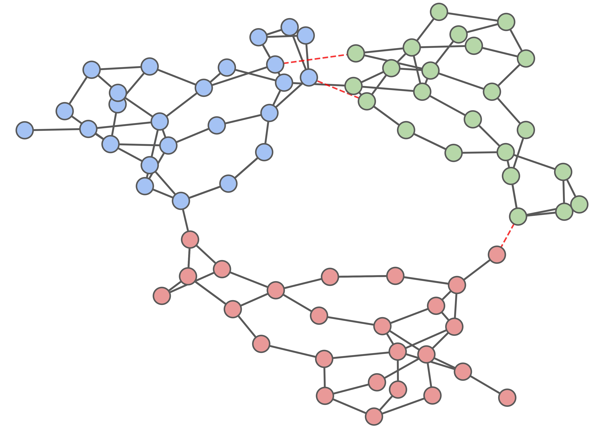

[](https://opensource.org/licenses/MIT)

# Tree partitioning
The repository contain implementations of *tree partitioning* algorithms for power transmission networks, turning the network into clusters that are connected in a tree-like manner.

See [our paper](#paper) for more information about tree partitioning and the implemented algorithms.



## Installation
Make sure to have [Poetry](https://python-poetry.org/) installed with version 1.8 or higher. 
The following command will then install all necessary dependencies:

```bash
poetry install
```

If you don't have Poetry installed, make sure that you have Python 3.9 or higher and install the packages indicated in the `pyproject.toml` file. 

Running the code also requires a [Gurobi](https://www.gurobi.com/) license. 

See the `experiments/` folder for the experiment scripts that were ran for the paper.

## Paper

For more details about tree partitioning, see our paper [*Mixed-integer linear programming approaches for tree partitioning of power networks*](https://ieeexplore.ieee.org/document/10872801). If this code is useful for your work, please consider citing our work:

``` bibtex
@article{LanZocca2025,
  title = {Mixed-Integer {{Linear Programming Approaches}} for {{Tree Partitioning}} of {{Power Networks}}},
  author = {Lan, Leon and Zocca, Alessandro},
  year = {2025},
  journal = {IEEE Transactions on Control of Network Systems},
  pages = {1--10},
  issn = {2325-5870},
  doi = {10.1109/TCNS.2025.3538472},
}
```

A preprint of this paper is available on [arXiv](https://arxiv.org/abs/2110.07000).
